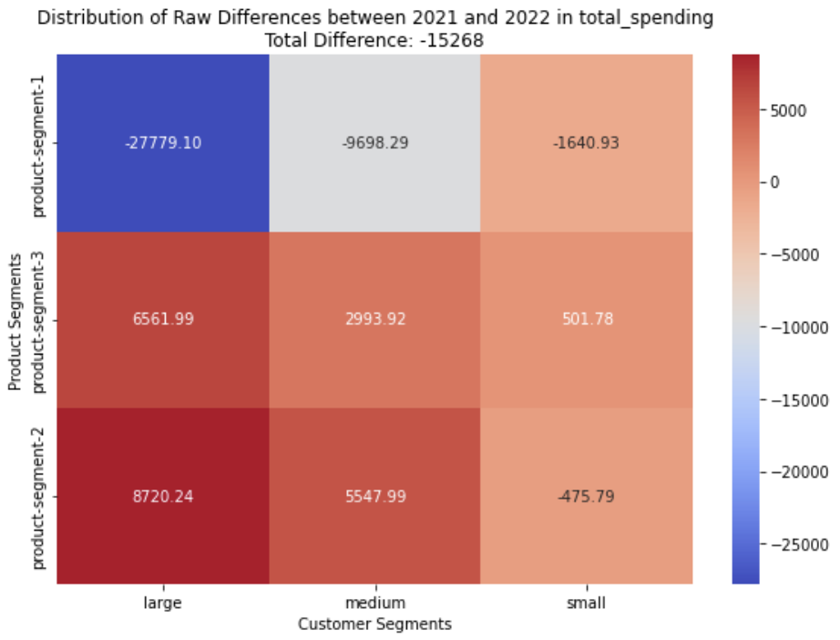

# Repeated Customers Analysis

## Overview

This project focuses on analyzing the behavior of repeated customers by using matrix visualizations to compare spending patterns across different product segments and customer segments over multiple years. The visualization helps highlight differences in customer spending year over year, enabling businesses to derive actionable insights from the data.

## Applicability of Matrix Visualization

### 1. **Flexible Customer and Product Segmentation**
The matrix visualization is highly flexible, allowing for an unlimited number of customer and product segments. These segments can be dynamically defined based on the available data. The typical customer segments could be:
- **Small customers**
- **Medium customers**
- **Large customers**

Similarly, product segments can vary based on the business needs, such as:
- **Product-Segment-1**
- **Product-Segment-2**
- **Product-Segment-3**

*Note: The sum of the percentages inside each cell in the second matrix does not equal 100%. This is because the values represent two different metrics: the difference in percentage from the previous year for each specific segment and the segment's contribution to the total percentage difference. These are calculated separately, and thus do not sum to 100% within each cell.*
  
The visualizations can handle **any number of customer and product segments**, making the code adaptable to various datasets without needing to adjust for specific segment names or structures.

### 2. **Year-over-Year Comparison Across Multiple Years**
The matrix visualization also supports the comparison of data over multiple years. The structure is designed to dynamically compare spending changes between **consecutive years**, regardless of how many years of data are available. This flexibility allows for easy adaptation to datasets with different year ranges.

### 3. **Identification of Patterns and Trends**
With this visualization, businesses can quickly identify important patterns, such as:
- **High-growth segments**: Customer segments with significant increases in spending.
- **Declining segments**: Customer or product combinations that show a significant drop in spending.
  
This enables businesses to spot trends over time across multiple years and make adjustments to their marketing, sales, or product strategies.

### 4. **Actionable Insights for Marketing and Sales**
This matrix visualization helps identify trends and areas that may require action, such as:
- Developing targeted marketing campaigns for high-growth segments.
- Offering promotions to reverse declining trends in certain product segments.
- Shifting resources toward high-performing products or customer groups.

The matrix visualization allows businesses to base decisions on actual data rather than assumptions, resulting in more effective strategies.

## Explanation of `combined_df.csv`

The file `combined_df.csv` is generated as part of the analysis. It provides a combined dataset containing **year-to-year differences** for each customer across different product segments. This dataset enables further external analysis, beyond what is visualized in the matrix.

### Structure of `combined_df.csv`

The `combined_df.csv` file contains the following columns:
- **customer_id**: The unique identifier for each customer.
- **customer_segment**: The segment the customer belongs to (e.g., small, medium, large).
- **year_to_year**: The consecutive years being compared (e.g., 2021_2022, 2022_2023).
- **product-segment-X_previous**: The total spending in the previous year for the specific product segment.
- **product-segment-X_following**: The total spending in the following year for the specific product segment.
- **product-segment-X_diff**: The raw difference in spending between the two years for the product segment.
- **total_value_previous**: The total spending across all product segments in the previous year.
- **total_value_following**: The total spending across all product segments in the following year.
- **total_diff**: The total raw difference in spending between the two years across all product segments.

### Applicability of `combined_df.csv`

The `combined_df.csv` file is a powerful tool for researchers and analysts looking to **dive deeper into individual customer behaviors** across multiple product segments over time. After gathering high-level insights from the matrix visualization, this CSV file allows for a more granular investigation into how specific customers have changed their spending habits across different product categories between consecutive years.

By using a spreadsheet tool like Excel or Google Sheets, you can perform **in-depth analyses** on individual customers and their year-to-year differences in spending across multiple product segments.

### Insights from `combined_df.csv`:

1. **Track Customer Performance Across Product Segments**:
   - The CSV file provides data on each customer’s **spending differences** for multiple product segments. For each customer, you can track how their spending has changed across product-segment-1, product-segment-2, and product-segment-3 between consecutive years.
   - This allows businesses to understand how **specific customers** interact with different product lines over time. You might identify customers who are increasing their engagement with certain product segments while reducing spending on others.

2. **Identify Key Customers Driving Product Growth or Decline**:
   - By filtering the CSV file, you can isolate **customers who have increased or decreased spending** in specific product segments. This can help you spot which customers are responsible for growth in certain areas and which customers may need attention due to declining engagement.
   - For example, after spotting growth in **product-segment-1** in the matrix visualization, you can use the CSV to identify which specific customers contributed the most to that growth.

3. **Drill Down into Customer-Specific Insights**:
   - The CSV allows you to drill down into the behavior of individual customers. You can track their spending across multiple segments and years, giving you the ability to answer questions like:
     - Is the customer consistently increasing or decreasing spending across all segments?
     - Are they shifting their spending from one product segment to another?
     - Have they stopped purchasing from certain segments altogether?

4. **Identify Customer-Specific Trends**:
   - By analyzing year-to-year differences in each product segment, you can detect trends in customer behavior. For example, some customers might consistently increase spending on one product segment while reducing it on others. This insight can guide personalized marketing strategies or help you decide whether to focus on customer retention or cross-selling additional products.

### Use Case Example:

Imagine you've identified a significant overall decline in spending on **product-segment-2** within the **small customer segment** using the matrix visualization. By analyzing `combined_df.csv`, you can:
1. **Filter the data** to focus on **small customers** and the columns related to **product-segment-2**.
2. **Sort** the customers by their `product-segment-2_diff` to find those with the largest declines in spending.
3. **Examine Individual Patterns**: You can look at the customers’ spending in `product-segment-2_previous` and `product-segment-2_following` to see the exact reduction in spending and compare it to their behavior in other product segments. For example, did they shift their spending to other segments, or is their overall spending declining?

4. **Actionable Insight**: Based on these findings, you could:
   - Create a personalized campaign to re-engage the customers who reduced their spending on **product-segment-2**.
   - Offer incentives for them to return to this product line or explore other segments where they are still active.

### Spreadsheet-Based Drill-Down:

Once loaded into a spreadsheet, the **`combined_df.csv`** enables you to:
- **Filter by customer segment and year-to-year range** to focus on specific cohorts or periods.
- **Sort customers by their spending differences** across each product segment, allowing you to prioritize actions (e.g., re-engagement strategies for those with the largest declines).
- **Visualize customer journeys** by comparing year-to-year spending changes across all product segments, revealing trends that are otherwise hard to spot in aggregated data.

### Summary of Benefits:
- **Detailed Customer Behavior Tracking**: The CSV enables businesses to track how individual customers interact with different product segments over time, allowing for a better understanding of their buying patterns.
- **Data-Driven Retention Strategies**: By identifying customers who have decreased spending in specific segments, businesses can design personalized retention strategies.
- **Cross-Sell and Up-Sell Opportunities**: By examining shifts in customer spending across segments, businesses can identify opportunities to promote other product lines or enhance customer loyalty with targeted offers.

## Conclusion

The matrix visualization and `combined_df.csv` file provide powerful tools for analyzing customer behavior over time, supporting multiple product and customer segments dynamically. With the ability to handle unlimited segments and years, this project offers a scalable solution for businesses looking to derive insights from their repeated customers' spending behavior.
